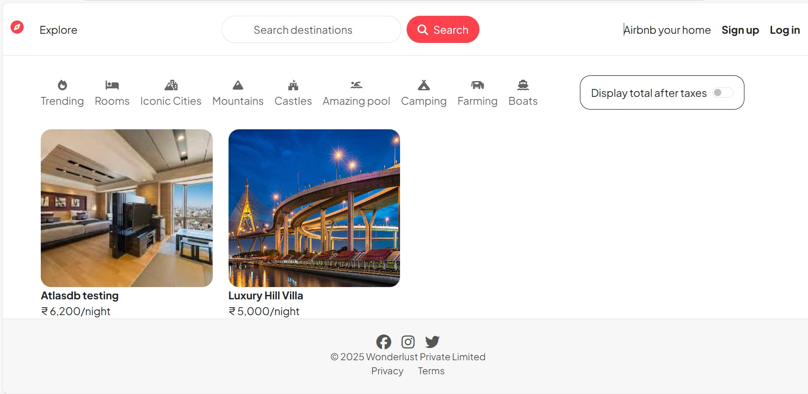
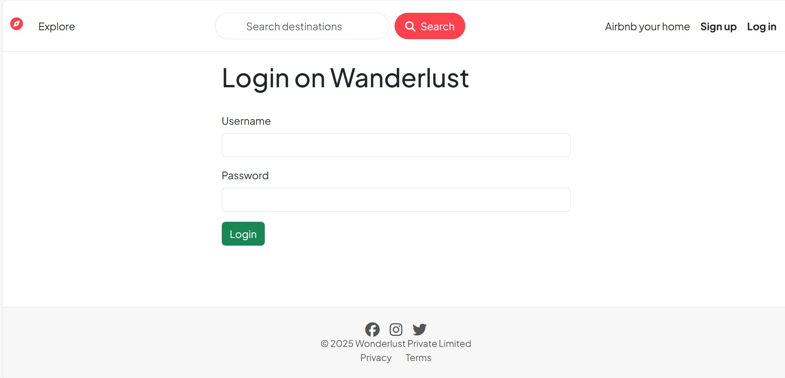
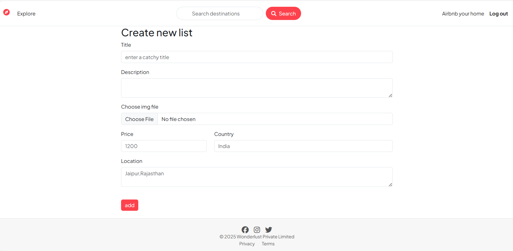

# 🏠 Airbnb Clone  

A full-stack web application inspired by Airbnb, built using the MERN stack.  

🔗 **Live Demo:** [Click Here](https://airbnb-clone-0tl8.onrender.com/listings)

🚀 Features

User authentication (signup/login)

Add new property listings

Browse and search available properties

Booking functionality

Responsive UI for both desktop and mobile

🛠 Tech Stack

Frontend: React.js, HTML, CSS, JavaScript
Backend: Node.js, Express.js
Database: MongoDB
Other Tools: Git, GitHub, Postman

📸 Screenshots (Optional)

⚙️ Installation & Setup

Follow these steps to run the project locally:

Clone the repository

git clone https://github.com/<your-username>/airbnb-clone.git
cd airbnb-clone

Install dependencies

npm install
cd client
npm install

Start the backend server

npm run server

Start the frontend React app

cd client
npm start

Open http://localhost:3000 in your browser.

📚 Learning Highlights

Gained hands-on experience with MERN stack

Learned how to connect frontend and backend

Understood the basics of REST APIs and database integration

Improved debugging skills through real-world application development

🔮 Future Improvements

Payment gateway integration

Advanced search filters (by price, location, date)

User reviews & ratings

Image upload for listings

👤 Author

Shivashanker Pothuganti

[GitHub Profile](https://github.com/shivashanker123)

[LinkedIn Profile](https://www.linkedin.com/in/shivashanker-pothuganti/)
